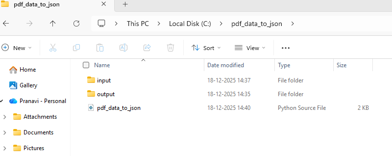
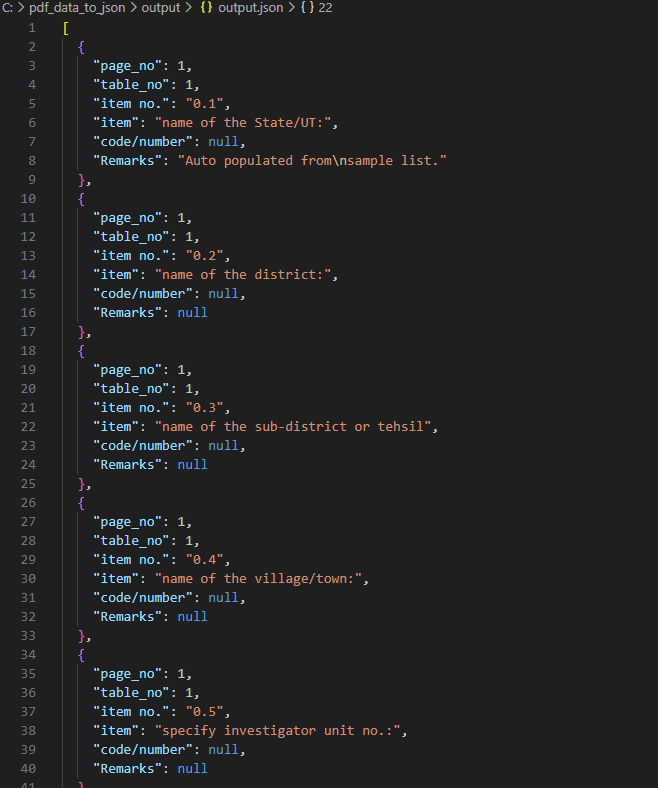
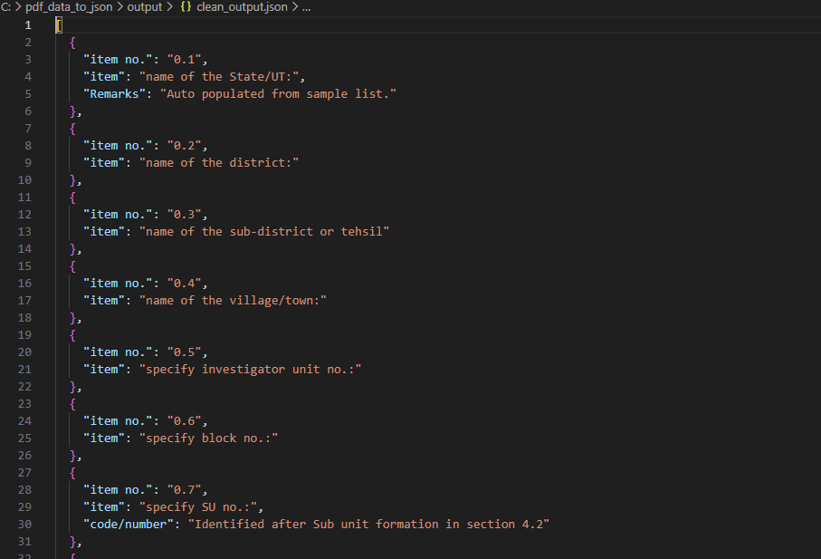

# 📄 PDF to JSON Converter using Python

A Python project to extract tabular data from PDF files and convert it into structured JSON format.

---

## ➥ OBJECTIVE

This project reads a PDF file containing tables and converts the tabular data into JSON format.  
The generated JSON can be easily used for data analysis, storage, or further processing.

---

## 🛠️ Technologies Used

### 1. Python 3

### 2. pdfplumber

### 3. JSON

---

## 📁 Project Structure

```text
pdf-to-json-converter/
├── input/
│   └── sample.pdf
├── output/
│   ├── output.json
│   └── clean_output.json
├── pdf_data_to_json.py
├── clean_json.py
├── requirements.txt
└── README.md

```
## ⚙️ HOW DOES IT WORK ?

1. The PDF file is opened using the **pdfplumber** library.
2. Each page of the PDF is scanned to detect tables.
3. Table headers are mapped to their corresponding row values.
4. Extracted data is stored in structured **JSON** format.
5. An optional cleaning script removes null values and unwanted fields.

---

## ▶️ HOW TO RUN THE PROJECT ?

### 1️⃣ Install required dependencies

pip install -r requirements.txt

### 2️⃣ Convert pdf tables to raw JSON
python pdf_data_to_json.py

### 3️⃣ Clean the JSON output
python clean_json.py

---

## 📸 Screenshots

### Project Folder Structure



### Command Prompt – PDF to JSON


### Raw JSON Output


### Command Prompt – Clean JSON


### Clean JSON Output


---

## 📄OUTPUT

### output/output.json

Raw JSON extracted directly from PDF tables

Includes page number, table number, and extracted fields

### output/clean_output.json

Cleaned JSON with:

Removed null values

Removed page_no and table_no

Cleaned multiline text

---

## 🎯 RESULT 

The project successfully converts complex, multi-page PDF tables into structured and readable JSON format, making the data suitable for further use.


